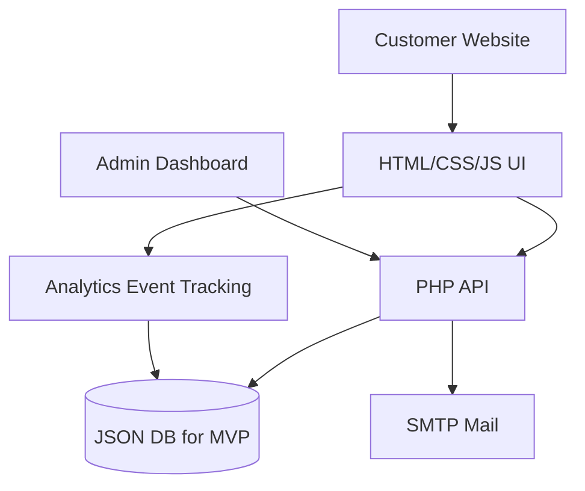
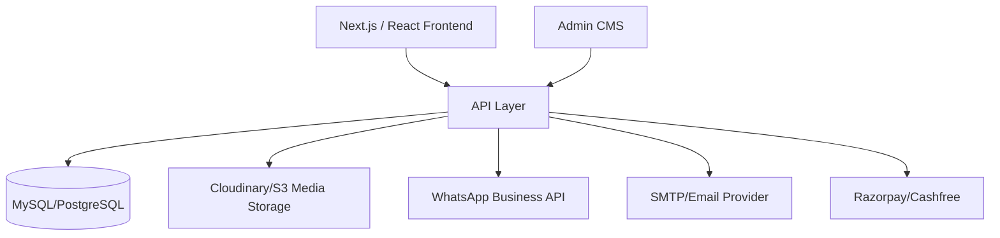

# TOURIM Complete System Design

## Architecture

## Production Migration

## Modules

- Public website: home, packages, package details, destinations, destination details, hotels, blogs, blog details, offers, gallery, about, contact.
- Admin CMS: dashboard, package manager, destination manager, hotel manager, blog manager, offer manager, enquiry manager, homepage manager, settings, notifications.
- API: get data, login, save CMS, submit enquiry, track analytics event, SMTP email.
- Data: settings, homepage, packages, destinations, hotels, blogs, offers, enquiries, analytics, notifications, activity, testimonials, FAQs, gallery.

## Rationale

The build keeps the current PHP/static hosting compatibility but adds scalable structure. Shared hosting can run immediately, while the schema and docs prepare TOURIM for MySQL, role-based users, payment, WhatsApp API, and a full booking engine.
